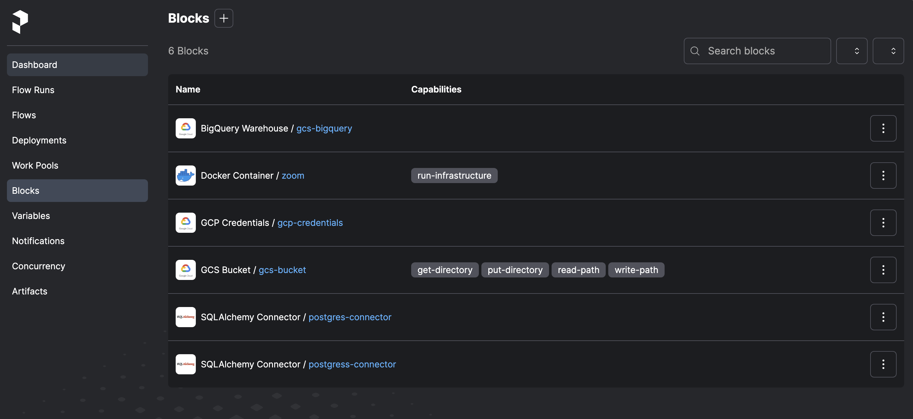

>Back: [Lesson 1: Introduction to Data Engineering](1_introduction.md)

->Next: [Lesson 3: Data Warehouse](3_data_warehouse.md)

# table of contents

- [table of contents](#table-of-contents)
- [Week2](#week2)
- [Data Ingestion](#data-ingestion)
- [Data Lake](#data-lake)
  - [What is a Data Lake?](#what-is-a-data-lake)
  - [Data Lake vs Data Warehouse](#data-lake-vs-data-warehouse)
  - [ETL vs ELT](#etl-vs-elt)
  - [Data Swamp - Data Lakes gone wrong](#data-swamp---data-lakes-gone-wrong)
  - [Data Lake Cloud Providers](#data-lake-cloud-providers)
- [Orchetrating dataflow with prefect](#orchetrating-dataflow-with-prefect)
    - [Flow](#flow)
    - [Task](#task)
    - [Blocks](#blocks)
- [Configure Block GCP Cloud Storage Bucket Connector](#configure-block-gcp-cloud-storage-bucket-connector)
- [Orchestration using Docker via a Dockerfile deployment](#orchestration-using-docker-via-a-dockerfile-deployment)
- [Creating a Docker block in code: an alternative to creating a DockerContainer block in the UI](#creating-a-docker-block-in-code-an-alternative-to-creating-a-dockercontainer-block-in-the-ui)
- [Prefect cloud](#prefect-cloud)
- [Orchestrating dataflow with Mage](#orchestrating-dataflow-with-mage)
- [Mage setup](#mage-setup)


# Week2

# Data Ingestion

This lesson will cover the topics of _Data Lake_ and _pipelines orchestration with Prefect and Mage_.

_[Back to the top](#table-of-contents)_

# Data Lake

_[Video source](https://www.youtube.com/watch?v=W3Zm6rjOq70&list=PL3MmuxUbc_hJed7dXYoJw8DoCuVHhGEQb&index=16)_

## What is a Data Lake?

A **Data Lake** is a central repository that holds big data from many sources. It serves as a storage system for large volumes of structured, unstructured, and semi-structured data. The main goal of a Data Lake is to enable quick and efficient data ingestion, making it available to various team members for analysis and processing. With its scalable and secure architecture, a Data Lake can run on inexpensive hardware, making it a cost-effective solution for storing and processing vast amounts of data.


A Data Lake should be:
* Secure
* Scalable
* Able to run on inexpensive hardware

## Data Lake vs Data Warehouse

A Data Lake (DL) and a Data Warehouse (DW) have distinct differences in terms of
data processing, size, nature, users, and use cases.

In terms of data processing, a DL contains raw and minimally processed data,
often unstructured. On the other hand, a DW contains refined data that has been
cleaned, pre-processed, and structured for specific use cases.

When it comes to size, DLs are large and can hold vast amounts of data, typically
in the order of petabytes. The data in a DL is transformed when it is used and can be stored indefinitely. In contrast, DWs are smaller in comparison and the data is always preprocessed before ingestion. It may also be purged periodically.

The nature of the data differs as well. DLs contain undefined data that can be used for a wide variety of purposes. On the other hand, DWs primarily store historic and relational data, such as transaction systems.

The intended users of DLs are data scientists and data analysts, while DWs are primarily used by business analysts.

In terms of use cases, DLs are commonly used for stream processing, machine learning, and real-time analytics. On the other hand, DWs are often used for batch processing, business intelligence, and reporting.


Data Lakes came into existence because as companies started to realize the importance of data, they soon found out that they couldn't ingest data right away into their DWs but they didn't want to waste uncollected data when their devs hadn't yet finished developing the necessary relationships for a DW, so the Data Lake was born to collect any potentially useful data that could later be used in later steps from the very start of any new projects.

## ETL vs ELT

When it comes to ingesting data, Data Warehouses (DWs) and Data Lakes (DLs) follow different models. DWs typically use the Export, Transform, and Load (ETL) model, while DLs often use the Export, Load, and Transform (ELT) model.

The key distinction between these models lies in the order of steps. In the ETL model used by DWs, data is transformed (preprocessed, cleaned, etc.) before being loaded into the warehouse. This approach, known as Schema on Write, ensures that the data is in a structured format that aligns with the warehouse's schema.

On the other hand, DLs adopt the ELT model, where data is loaded into the lake without any transformations. The data is stored in its raw form, and the transformations are applied when the data is read from the lake. This approach, known as Schema on Read, allows for more flexibility in analyzing and processing the data, as the schemas can be derived dynamically based on the specific use case.

In summary, while DWs prioritize transforming the data before loading it into the warehouse, DLs focus on loading the raw data and performing transformations when needed. The choice between ETL and ELT depends on factors such as data complexity, processing requirements, and the desired level of flexibility in data analysis.


## Data Swamp - Data Lakes gone wrong

Data Lakes are only useful if data can be easily processed from it. Techniques such as versioning and metadata are very helpful in helping manage a Data Lake. A Data Lake risks degenerating into a ***Data Swamp*** if no such measures are taken, which can lead to:
* No versioning of the data
* Incompatible schemes for the same data
* No metadata associated
* Joins between different datasets are not possible

## Data Lake Cloud Providers

* Google Cloud Platform > [Cloud Storage](https://cloud.google.com/storage)
* Amazon Web Services > [Amazon S3](https://aws.amazon.com/s3/)
* Microsoft Azure > [Azure Blob Storage](https://azure.microsoft.com/en-us/services/storage/blobs/)

_[Back to the top](#table-of-contents)_

# Orchetrating dataflow with prefect


The files for this session are in the folder `chapter_2` in the repo. [ETL files](Data_Engineering/week_2_workflow_orchestration/chapter_2)

1. install requirement.txt

2. Prefect orchestration

Prefect is an open-source Python-based flow orchestrator tool that allows creation of flows with tasks and subtasks.


### Flow

A prefect flow is a collection of tasks that are schedulked and executed. It is a python function that is decorated with `@flow` decorator. It is configured with the following parameters such as name, schedule, environment, storage, and executor.

```python
@flow(name= 'ingest_data', )
def main() -> None:
    connector()
    df: pd.DataFrame = ingest_data()
    df: pd.DataFrame =transform_data(df)
    load_data(df)
    return None
```

### Task

A Task is an action within a flow. It is a python method that performs any kind of action
it is configured with the following parameters:

* **name**: unique identifier of task. `name = "ingest_data"`
* **log_prints**: prints logs to comsole and tracks tasks. `log_prints=True`
* **retries**: configure number of tries. `retries=3`
* **cache_key**: caches a result into memory, so it doesn't have to re-execute in the event of an error. `from prefect.tasks import task_input_hash`
* **timeout**: time in seconds before timeout error. `timeout=6`
* **trigger rule**: when to trigger next task. `trigger=prefect.triggers.all_done()`
* **cache_expiration**: how long cache results. `cache_expiration=timedelta(days=7)`


```python
# connector is cached till 10 weeks for reuse
@task(log_prints=True, cache_key_fn=task_input_hash, cache_expiration=timedelta(weeks=10))
def connector() -> None:
    connector = SqlAlchemyConnector(
            connection_info=ConnectionComponents(
                driver=SyncDriver.POSTGRESQL_PSYCOPG2,
                username= os.getenv(key="user"),
                password= os.getenv(key="password"),
                host= os.getenv(key="host"),
                port= os.getenv(key="port"),
                database=os.getenv(key="databaseName"),
                network=os.getenv(key="docker_network")                        
            )
    )
    connector.save(name=os.getenv(key="BLOCK_NAME"), overwrite=True)
```

### Blocks

Blocks are store connectors that connects our flow with external resources such as databricks, Azure, Docker, GCS Bucket etc. They can be either created by command line (CLI) or GUI.

```python
from prefect_gcp.cloud_storage import GcsBucket
gcs_block = GcsBucket.load("gcs-bucket")
```

# Configure Block GCP Cloud Storage Bucket Connector

1; Start prefect server in terminal: `prefect server start`

To register the **Prefect Connector** module for **Google Cloud Platform** from the command line and make it available for use in our flow, follow these steps:

2; Start by opening the command line interface.

3; Run the following command to register the module:

```
prefect block register -m prefect_gcp
```

This command will register the **Prefect Connector** module for **Google Cloud Platform** and make it accessible for use in your flow.

4; Once the registration is complete, you can proceed to use the module in your flow to connect with Google Cloud Platform services.

Remember to replace any placeholder values with the actual values specific to your setup.


5; Populate the block with conection details to our GCP Storage. Go to the prefect GUI -> blocks -> search for `GCS Bucket`:

    * **Block name**: name for Block `gcs-bucket`
    * **Bucket**: Name of the cloud storage created in GCP
    * **GCP Credentials**:
        **Block Name**: name of credential. `google-creds`
        ***bucket**: name of the bucket
        **credentials**: create new credential by copying JSON content of service account
    blocks created:
        1. GCS Bucket: `gcs-bucket`
        2. GCp Credentials: `google-creds`
   
The files for creating GC~s buckets are found in the folder `chapter_3` and `chapter_4` in the repo. [ETL files](Data_Engineering/week_2_workflow_orchestration/chapter_3)



For more information visit [Prefect documentaion](docs.prefect.io)

6. Once the blocks have been defined, you need to create the deployment. Build the prefect deployment using the command line.


   ```shell
   prefect deployment build parameterized_flow.py:etl_grandparent_flow -n "Parameterized ETL" -a
   ```

To explain the command:

```shell
prefect deployment build python_file.py:flow_name -n "name of deployment" -a
```

The tag:  `-a` to apply at the same time.

It creates a metadata that tells the orhestrator which workflow to deploy.
This creates a deplpoyment yaml file: `prefect deployment apply etl_grandparent_flow-deployment.yaml`

To change the fow variables you can edit the flow parameters in the yaml file or in the prefect UI: {"color":"yellow", "month":[1,2,3], "year":2021}

7; Run the deployment in the prefect deployment UI

To do that, start an agent to to run the deployment with the command:

```shell
    prefect agent start --pool "default-agent-pool
```

# Orchestration using Docker via a Dockerfile deployment

When deploying a flow using Docker, you need to create a Dockerfile that specifies the environment and dependencies required to run the flow. This Dockerfile will be used to build a Docker image that contains the flow and its dependencies.

a. create Dockerfile

```dockerfile
FROM prefecthq/prefect:2.7.7-python3.9

COPY docker-requirement.txt .

RUN pip install -r docker-requirement.txt --trusted-host pypi.python.org --no-cache-dir

COPY chapter_2 /opt/prefect/flows

COPY chapter_2/new_data /opt/prefect/data
```

b. Build the docker image:
`docker build -t albydel/prefect:DE .`

c. Push docker image to dockerhub, but first sign in to docker hub with command

```shell
docker login
```

then push the image to docker hub

```shell
docker image push albydel/prefect:DE
```

6; Create docker block with the Prefect UI and define these parameters:

* Block Name: `zoom`
  
* image: `albydel/prefect:DE`
  
* image pull policy: `Always`

* auto remove: `true`

image pull policy always ensures that the image is always pulled from the repository.

auto remove sets the container to remove itself after the task is completed.


# Creating a Docker block in code: an alternative to creating a DockerContainer block in the UI

The files are here:

[Flow scripts](/Data_Engineering/week_2_workflow_orchestration/chapter_3/flows)

1; To create a DockerContainer block in code, you can use the DockerContainer class from the prefect.infrastructure.container module.

```python
docker_block = DockerContainer(
    image="albydel/prefect:DE",
    image_pull_policy="ALWAYS",
    auto_remove=True,
    network_mode="bridge"
)
docker_block.save("zoom", overwrite=True)
```

2; Create a deployment file called `docker_deployment.py` to deploy the Docker block from a Python file.

```python
from prefect.deployments import Deployment 
from prefect.infrastructure.container import DockerContainer
from parameterized_flow import etl_grandparent_flow

docker_block = DockerContainer.load("zoom")

docker_deploy = Deployment.build_from_flow(
    flow=etl_grandparent_flow,
    name="docker-flow",
    infrastructure=docker_block
)

if __name__ == "__main__":
    docker_deploy.apply()
```

3. Run the deployed task

Running this file will deploy the flow using the Docker block created in the previous step.

```shell
python docker_deployment.py
```

4. Checking the profile, it shows that we are using the default profile

```shell
prefect profile ls
```

5. Use the API endpoint to enable the Docker container to interact with the Prefect server

```shell
prefect config set PREFECT_API_URL="http://127.0.0.1:4200/api"
```

6. Start the API agent. The agent picks up any queue and executes it.

```shell
prefect agent start --work-queue "default"
```

7. Run the queue with the parameter `month=7`

```shell
prefect deployment run parent_flow_runner/docker-flow -p "month=7" -p "color=yellow" -p "year=2020"
```

# Prefect cloud

Prefect cloud is a 
* cloud-based orchestration platform that allows you to manage and monitor your flows from a centralized location.
* It provides a user-friendly interface for creating, deploying, and monitoring flows, as well as managing infrastructure and agents.
* Prefect Cloud also offers advanced features such as version control, collaboration tools, and integrations with other services.
* It is a paid service that offers a free tier with limited features and usage.

To use prefect cloud, you need to create an account and obtain an API key. You can then log in to the Prefect Cloud platform using the API key and create and manage your flows.

Follow these steps:

1. Go to prefect cloud and create API keys

2. Login with the API key with commmand
    
```shell
prefect cloud login -k <API_KEY>
```

3; Create `docker block`, `bigquery block`, `gcs bucket block`, `gcp credentials`

3; Create and run the deployment file `python docker_deployment.py`

```python
from prefect.deployments import Deployment 
from prefect.infrastructure.container import DockerContainer
from parameterized_flow import etl_grandparent_flow

docker_block =DockerContainer.load("zoomcontainer") ## NB: zoomcontainer is cloud bucket

docker_deploy = Deployment.build_from_flow(
                flow=etl_grandparent_flow,
                name="docker-flow",
                infrastructure=docker_block
            )

if __name__=="__main__":
    docker_deploy.apply()
```

After this step, you can see your flows in the  UI

To run the flow, activate the agent first with the command:

```shell
prefect agent start --work-queue "default" --no-cloud-agent
```

Then run the deployment with the command:

```shell
prefect deployment run parent_flow_runner/docker-flow -p "month=7" -p "color=yellow" -p "year=2020"
```

Prefect also allows you to create a github block to run your flows from github. This is done by creating a github block in the prefect UI and specifying the github repository and branch from which the flow will be run.

1. create github block

```python
from prefect.deployments import Deployment
from etl_to_gcs import main_flow 
from prefect.filesystems import GitHub

github_block = GitHub.load("github-block")

deployment = Deployment.build_from_flow(
            flow=main_flow,
            name="github-deploy-code",
            version="1.0",
            storage=github_block,
            entrypoint='week_2_workflow_orchestration/homework/etl_to_gcs.py:actual_runner'
            )

if __name__=='__main__':
    deployment.apply()
```

# Orchestrating dataflow with Mage

Mage is an open-source, hybrid framework for transforming and integrating data. It is designed to simplify the process of building data pipelines by providing a unified interface for defining, orchestrating, and monitoring data workflows.

# Mage setup

This repo contains a Docker Compose template for getting started with a new Mage project. It requires Docker to be installed locally.

You can start by cloning the repo:

```bash
git clone https://github.com/mage-ai/mage-zoomcamp.git mage
```

Navigate to the repo:

```shell
cd mage
```

Rename dev.env to simply .env— this will ensure the file is not committed to Git by accident, since it will contain credentials in the future.

Define secretes in `.env` file

Edit the docker-compose.yml with path to GCP.json credential

Now, let's build the container

```shell
docker compose build
```

Finally, start the Docker container:

```bash
docker compose up
```

Now, navigate to <http://localhost:6789> in your browser! Voila! You're ready to get started with the course.


Define docker postgress connector in `io_config.yml` in mage files. the postgres instance is defined in docker

```yml
dev:
  POSTGRES_CONNECT_TIMEOUT: 10
  POSTGRES_DBNAME: "{{ env_var('POSTGRES_DBNAME') }}"
  POSTGRES_SCHEMA: "{{ env_var('POSTGRES_SCHEMA') }}" # Optional
  POSTGRES_USER: "{{ env_var('POSTGRES_USER') }}"
  POSTGRES_PASSWORD: "{{ env_var('POSTGRES_PASSWORD') }}"
  POSTGRES_HOST: "{{ env_var('POSTGRES_HOST') }}"
  POSTGRES_PORT: "{{ env_var('POSTGRES_PORT') }}"
```


<p align='center'>specifying the postgress connector</p>


<p align='center'>testing the docker postgres connection</p>

->Next: [Lesson 3: Data Warehouse](3_data_warehouse.md)