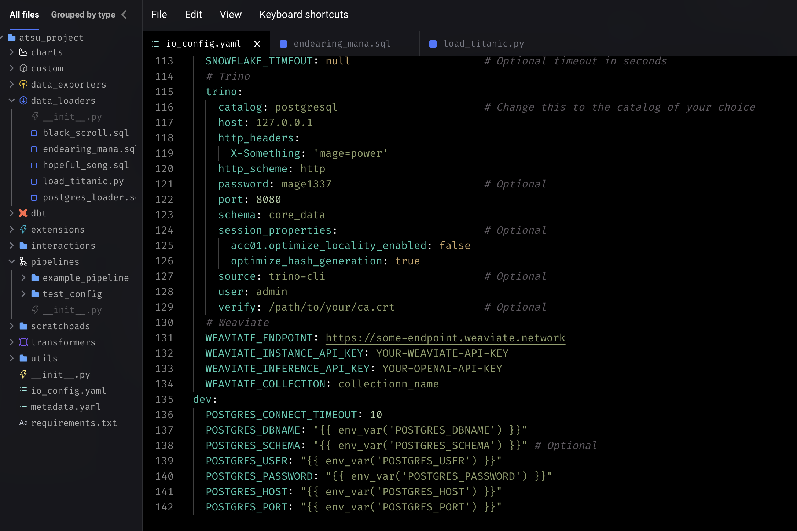
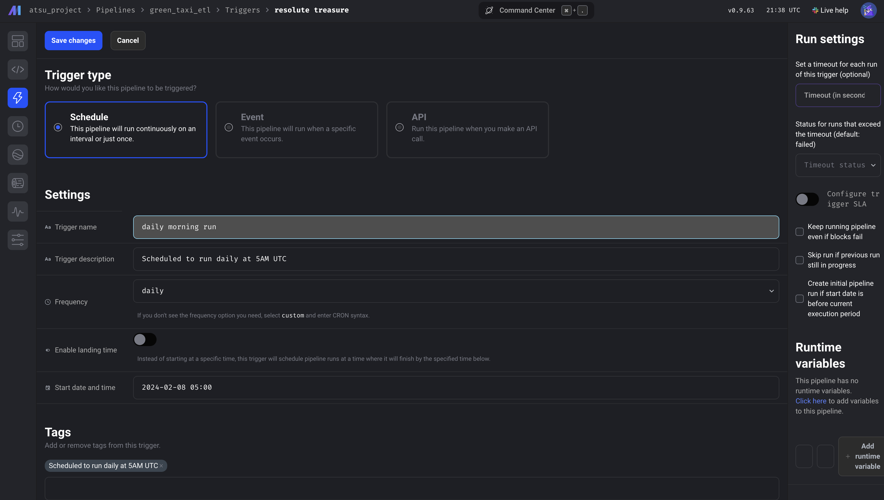

# Week2

## orchetrating dataflow with prefect

1. install requirement.txt

2. prefect orchestration

```
prefect is an open-source Python-based flow orchstrator tool that allows creation of flows with tasks and subtasks.
```

**`Flow`** : collection of tasks that are schedulked and executed

```python
@flow(name= 'ingest_data', )
def main() -> None:
    connector()
    df: pd.DataFrame = ingest_data()
    df: pd.DataFrame =transform_data(df)
    load_data(df)
```

**`Task`** : an action within a flow. It is a python method that performs any kind of action
it is configured with the following parameters:

* **name**: unique identifier of task. `name = "ingest_data"`
* **log_prints**: prints logs to comsole and tracks tasks. `log_prints=True`
* **retries**: configure number of tries. `retries=3`
* **cache_key**: caches a result into memory, so it doesn't have to re-execute in the event of an error. `from prefect.tasks import task_input_hash`
* **timeout**: time in seconds before timeout error. `timeout=6`
* **trigger rule**: when to trigger next task. `trigger=prefect.triggers.all_done()`
* **cache_expiration**: how long cache results. `cache_expiration=timedelta(days=7)`

```python
# connector is cached till 10 weeks for reuse
@task(log_prints=True, cache_key_fn=task_input_hash, cache_expiration=timedelta(weeks=10))
def connector() -> None:
    connector = SqlAlchemyConnector(
            connection_info=ConnectionComponents(
                driver=SyncDriver.POSTGRESQL_PSYCOPG2,
                username= os.getenv(key="user"),
                password= os.getenv(key="password"),
                host= os.getenv(key="host"),
                port= os.getenv(key="port"),
                database=os.getenv(key="databaseName"),
                network=os.getenv(key="docker_network")                        
            )
    )
    connector.save(name=os.getenv(key="BLOCK_NAME"), overwrite=True)
```

**`Blocks`** : store connectors that connects our flow with external resources such as databricks, Azure, Docker, GCS Bucket etc. They can be either created by command line (CLI) or GUI

```python
from prefect_gcp.cloud_storage import GcsBucket
gcs_block = GcsBucket.load("gcs-bucket")
```

## configure Block GCP Cloud Storage Bucket Connector

1. Start prefect server: `prefect server start`

2. Register **Prefect Connector** module for **Google Cloud Platform** from the command line to make it available for use in our flow `prefect block register -m prefect_gcp`

3. populate the block with conection details to our GCP Storage. Go to the GUI and follow. Go to blocks and search for `GCS Bucket`:

    * **Block name**: data name for Block `gcs-bucket`
    * **Bucket**: Name of the cloud storage created in GCP
    * **GCP Credentials**:
        **Block Name**: name of credential. `google-creds`
        ***bucket**: name of the bucket
        **credentials**: create new credential by copying JSON content of service account
    blocks created:
        1. GCS Bucket: `gcs-bucket`
        2. GCp Credentials: `google-creds`

#### NB: docs.prefect.io

4. Build prefect deployment via command line

    1. `prefect deployment build parameterized_flow.py:etl_grandparent_flow -n "Parameterized ETL" -a`

    NB: `-a` to apply at the same time
    * it creates a metadata that workflow orchestration needs to know to deploy

    2. edit the parameters: {"color":"yellow", "month":[1,2,3], "year":2021}

    3. `prefect deployment apply etl_grandparent_flow-deployment.yaml`

    4. run the deployment in the prefect deployment UI

    5. start an agent to to run the deployment
        `prefect agent start --pool "default-agent-pool`

    6. Dockerfile deployment

        a. create Dockerfile

        ```docker
        FROM prefecthq/prefect:2.7.7-python3.9

        COPY docker-requirement.txt .

        RUN pip install -r docker-requirement.txt --trusted-host pypi.python.org --no-cache-dir

        COPY chapter_2 /opt/prefect/flows

        COPY chapter_2/new_data /opt/prefect/data
        ```

        b. build the docker image:
        `docker build -t albydel/prefect:DE .`

        c. push docker image to dockerhub
        sign in to docker hub by `docker login`
        `docker image push albydel/prefect:DE`

    7. create docker block with the UI:
        set parameters:
         Block Name: `zoom`
         image: `albydel/prefect:DE`
         image pull policy: `Always`
         auto remove: `true`

### alternative to creating DockerContainer block in the UI

        save it in a file and import it

        ```python
        docker_block = DockerContainer(
            image="albydel/prefect:DE"
            image_pull_policy="ALWAYS",
            auto_remove=True,
            network_mode="bridge"
        )
        docker_block.save("zoom", overwrite=True)
        ```

    8. deploy from python file, create deploymenet file
        `docker_deployment.py`

        ```python
        from prefect.deployments import Deployment 
        from prefect.infrastructure.container import DockerContainer
        from parameterized_flow import etl_grandparent_flow

        docker_block =DockerContainer.load("zoom")

        docker_deploy = Deployment.build_from_flow(
                        flow=etl_grandparent_flow,
                        name="docker-flow"
                        infrastructure=docker_block
            )
        
        if __name__=="__main__":
            docker_deploy.apply()
        ```

        8.1. run the deployed task
            `python docker_deployment`

        8.2 check profile, shows that we are using the default profile
            `prefect profile ls`

        8.3 use API end point to enable docker container to interact with prefect server
            `prefect config set PREFECT_API_URL="http://127.0.0.1:4200/api"`

        8.4 start the API agent: the agent picks up any queue and execute it
            `prefect agent start --work-queue "default"`

        8.5 Run the queue with parameter month=7
            `prefect deployment run parent_flow_runner/docker-flow -p "month=7" -p "color=yellow" -p "year=2020"`

    9. Prefect cloud

        1. go to prefect cloud and create API keys

         API Keys: <API_KEYS>
         or run
         `prefect cloud login -k <API_KEY>`

         2. create `docker block`, `bigquery block`, `gcs bucket block`, `gcp credentials`

         3. create the deployment file and run deployment file

            ```python
            from prefect.deployments import Deployment 
            from prefect.infrastructure.container import DockerContainer
            from parameterized_flow import etl_grandparent_flow

            docker_block =DockerContainer.load("zoomcontainer") ## NB: zoomcontainer is cloud bucket

            docker_deploy = Deployment.build_from_flow(
                            flow=etl_grandparent_flow,
                            name="docker-flow",
                            infrastructure=docker_block
                        )

            if __name__=="__main__":
                docker_deploy.apply()

            ```

            `python docker_deployment.py` : then you can see your flows in UI

         4. activate the agent
        `prefect agent start --work-queue "default" --no-cloud-agent`

         5. run the deployment
        `prefect deployment run parent_flow_runner/docker-flow -p "month=7" -p "color=yellow" -p "year=2020"`

1.  create github block


```python
from prefect.deployments import Deployment
from etl_to_gcs import main_flow 
from prefect.filesystems import GitHub


github_block = GitHub.load("github-block")

deployment = Deployment.build_from_flow(
            flow=main_flow,
            name="github-deploy-code",
            version="1.0",
            storage=github_block,
            entrypoint='week_2_workflow_orchestration/homework/etl_to_gcs.py:actual_runner'
            )

if __name__=='__main__':
    deployment.apply()
```

## orchetrating dataflow with Mage

Mage is an open-source, hybrid framework for transforming and integrating data. ✨

## Mage setup

This repo contains a Docker Compose template for getting started with a new Mage project. It requires Docker to be installed locally. If Docker is not installed, please follow the instructions here.

You can start by cloning the repo:

```bash
git clone https://github.com/mage-ai/mage-zoomcamp.git mage
```

Navigate to the repo:

```bash
cd mage
```

Rename dev.env to simply .env— this will ensure the file is not committed to Git by accident, since it will contain credentials in the future.

define secretes in `.env` file

edit the docker-compose.yml with path to GCP.json credential

Now, let's build the container

```bash
docker compose build
```

<!--  -->
Finally, start the Docker container:

```bash
docker compose up
```

Now, navigate to <http://localhost:6789> in your browser! Voila! You're ready to get started with the course.


## define docker postgress connector in `io_config.yml` in mage files. the postgres instance is defined in docker

```yml
dev:
  POSTGRES_CONNECT_TIMEOUT: 10
  POSTGRES_DBNAME: "{{ env_var('POSTGRES_DBNAME') }}"
  POSTGRES_SCHEMA: "{{ env_var('POSTGRES_SCHEMA') }}" # Optional
  POSTGRES_USER: "{{ env_var('POSTGRES_USER') }}"
  POSTGRES_PASSWORD: "{{ env_var('POSTGRES_PASSWORD') }}"
  POSTGRES_HOST: "{{ env_var('POSTGRES_HOST') }}"
  POSTGRES_PORT: "{{ env_var('POSTGRES_PORT') }}"
```


<p align='center'>specifying the postgress connector</p>


<p align='center'>testing the docker postgres connection</p>